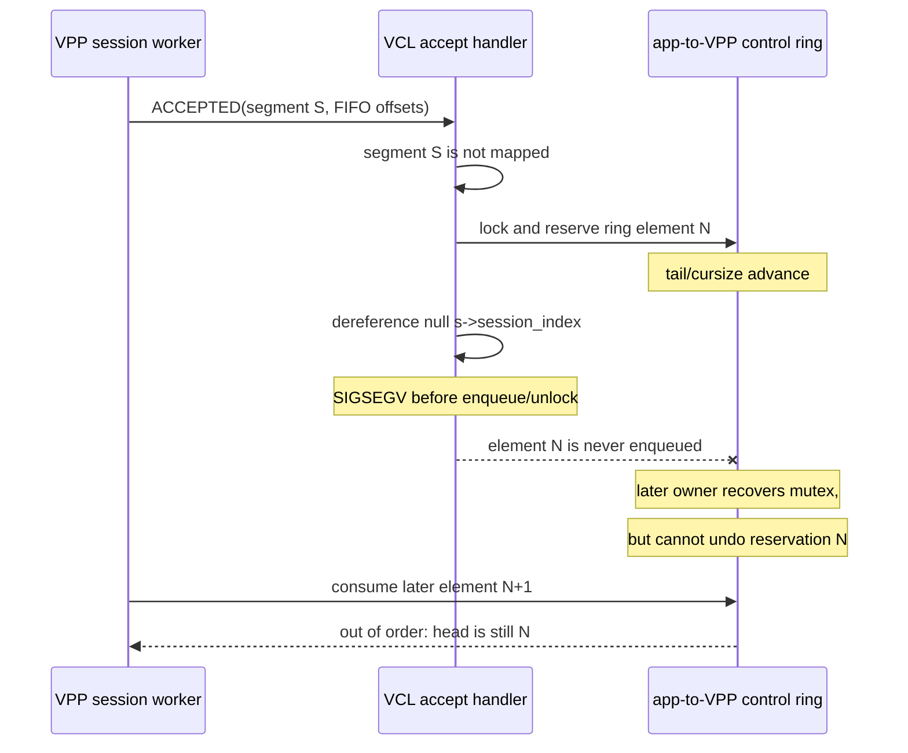

# Mode 2 sharded accept and MQ corruption investigation

Last verified: 2026-07-21

## 1. Current status

This is the audit trail for the remaining P0 Mode 2 accept failure. The latest
local run of:

```bash
sudo -E bash test/run_multiworker.sh --mode 2 4
```

failed during `TestMultiWorkerHTTPConcurrent`. The server process received
`SIGSEGV` in `vls_accept` through `vclpoll_accept_nb_full`, with fault address
`0x14`. The VPP process then logged messages such as:

```text
svm_msg_q_free_msg: message out of order: elt 23 head 22 ring 1
```

The dedicated sharded-accept scaling test can pass in the same run. That does
not clear the bug: ordinary concurrent HTTP accept load is sufficient to
expose it, and the full Mode 2 multi-worker suite is red.

The supported deployment position is therefore:

- Mode 3 remains the default and the currently validated path.
- Mode 2 client and light-load behavior is useful for development, but Mode 2
  concurrent listeners are not production-safe.
- The failure is independent of the worker-unregister lifecycle fix described
  in [§7](#7-relationship-to-worker-teardown).

The canonical priority and completion criteria live in
[../summary.md](../summary.md#3-pending-work).

## 2. What is established

The two visible failures are one chain, not evidence of an unlocked
VPP-to-application ring allocation race:

1. VCL handles a `SESSION_CTRL_EVT_ACCEPTED` event whose FIFO segment is not
   available in that VCL worker's segment table.
2. `vcl_segment_attach_session` fails, so
   `vcl_session_accepted_handler` enters its error path.
3. That path calls `vcl_send_session_accepted_reply(evt_q, mp, 0,
   SESSION_E_INVALID)` with a null `vcl_session_t *`.
4. `vcl_send_session_accepted_reply` first allocates an app-to-VPP control-ring
   element, then unconditionally evaluates `s->session_index`.
5. The null dereference terminates the application while it owns the robust MQ
   mutex and after the ring tail and size have advanced, but before the message
   is enqueued and the mutex is released.
6. A later producer can recover the owner-dead robust mutex, but mutex recovery
   cannot roll back the abandoned ring reservation. VPP eventually receives a
   later element while the ring head still points at the missing one, producing
   the `svm_msg_q_free_msg` out-of-order warning/assertion.

The relevant VPP source paths in the adjacent checkout are:

- `src/vcl/vppcom.c`: `vcl_session_accepted_handler` and
  `vcl_send_session_accepted_reply`;
- `src/vnet/session/application_interface.h`:
  `app_alloc_ctrl_evt_to_vpp` and `app_send_ctrl_evt_to_vpp`;
- `src/svm/message_queue.c`: `svm_msg_q_alloc_msg_w_ring` and
  `svm_msg_q_free_msg`;
- `src/svm/message_queue.h`: robust-mutex owner-death recovery.



The fault address `0x14` is consistent with dereferencing a field at a small
offset from a null `vcl_session_t *`. More importantly, the source has the
unconditional dereference on the exact error path; the fix must not depend on
the numeric offset remaining stable.

## 3. Why the original unlocked-MQ theory is incorrect

`app_wrk_send_ctrl_evt_inline` allocates a VPP-to-application control event
with `svm_msg_q_alloc_msg_w_ring` and does not acquire the MQ lock itself. In
isolation that looks unsafe. In the path at issue, however,
`app_worker_flush_events_inline` acquires the app worker's MQ lock before it
dispatches the staged events and releases it after the batch. The helper is an
inner, lock-assuming primitive.

Changing that helper to `svm_msg_q_lock_and_alloc_msg_w_ring` without changing
the outer protocol would try to acquire the same non-recursive lock twice and
can deadlock. It also addresses the wrong queue direction: the poisoned ring
in the observed crash is the app-to-VPP accepted-reply ring reserved by VCL
before the null dereference.

This distinction matters:

```text
VPP -> application
  per-VPP-thread staging FIFO
    -> app_worker_flush_events_inline takes app MQ lock
      -> app_wrk_send_ctrl_evt_inline allocates/enqueues while lock is held

application -> VPP
  vcl_send_session_accepted_reply
    -> app_alloc_ctrl_evt_to_vpp takes lock and reserves element
      -> null dereference leaves the reservation incomplete
```

## 4. Likely preceding trigger: cross-thread publication order

The null dereference explains the application crash and the subsequent ring
corruption. It does not by itself explain why the accepted session referenced
an unavailable segment.

The leading source-backed hypothesis is a semantic ordering gap between FIFO
segment publication and an accepted session that depends on that segment:

- `app_worker_add_segment_notify` stages `APP_ADD_SEGMENT` in
  `app_wrk->wrk_evts[creator_thread]`.
- `app_worker_add_event` stages `ACCEPTED` in
  `app_wrk->wrk_evts[session_thread]`.
- Those are separate per-VPP-thread FIFOs. Ordering is preserved within one
  FIFO, but there is no global order between different VPP worker FIFOs.
- A segment can be created on one VPP thread and then supply FIFOs to a session
  whose accepted notification is staged and flushed by another thread.
- If the second FIFO flushes first, VCL sees `ACCEPTED` before
  `APP_ADD_SEGMENT` and cannot attach the FIFO pointers.

```mermaid
flowchart LR
    Create[Thread A creates FIFO segment S] --> Add[Queue APP_ADD_SEGMENT(S)\non thread-A FIFO]
    Create --> Allocate[Thread B allocates accepted\nsession FIFOs from S]
    Allocate --> Accept[Queue ACCEPTED(S)\non thread-B FIFO]
    Accept --> FlushB[Thread B flushes first]
    FlushB --> Missing[VCL has not mapped S]
    Add --> FlushA[Thread A flushes later]
```

This ordering explanation is high confidence but still needs a deterministic
trace or regression test that records the segment handle and the two delivery
sequences. Documentation should not label it proven until that test exists.

## 5. Required fixes

### 5.1 Immediate VCL crash containment

Make the error reply null-safe in `vcl_send_session_accepted_reply`, for
example:

```c
rmp->app_session_index = s ? s->session_index : VCL_INVALID_SESSION_INDEX;
```

VPP's accepted-reply handler checks `retval` first and disconnects the rejected
session; it does not consume `app_session_index` on that error path. This fix
prevents the null dereference and ensures the already-reserved MQ element is
enqueued and unlocked. It contains both the app crash and the secondary ring
poisoning.

This is necessary defensive correctness, but it is not the complete fix. The
individual connection will still be rejected if its segment notification was
late.

### 5.2 Enforce segment-before-session publication

VPP must not deliver a session control event whose FIFO segment has not been
successfully published to that external app worker. Suitable upstream designs
include:

- a per-app-worker globally ordered stream for dependent control events;
- a segment-publication state/barrier that defers `ACCEPTED` until
  `APP_ADD_SEGMENT` succeeds;
- constraining allocation and notification so the add-segment and dependent
  session event share one ordered staging path.

The choice belongs in VPP's session/application-worker layer. A vclnet-side
lock cannot repair an event that arrives before the shared-memory segment is
known to VCL.

### 5.3 Add a deterministic regression

The regression must force FIFO-segment growth, create accepts on VPP worker
threads different from the segment creator, and assert:

1. every segment is added to VCL before any dependent `ACCEPTED` is handled;
2. a deliberately failed session attach produces a clean negative accepted
   reply rather than a signal;
3. the app-to-VPP control ring remains FIFO-consistent;
4. the full four-worker Mode 2 HTTP and sharded-accept tests pass repeatedly;
5. VPP remains alive and reports no MQ-order warning.

## 6. Reproduction and acceptance gate

Run the complete matrix against the exact library being released:

```bash
sudo -E bash test/run_integration.sh
sudo -E bash test/run_integration.sh --mode 2
sudo -E bash test/run_multiworker.sh --mode 3 4
sudo -E bash test/run_multiworker.sh --mode 2 4
```

The P0 is complete only when the last command is repeatably green under
concurrent HTTP and raw accept load, the deterministic segment-growth test is
green, and neither the application nor VPP emits the crash/MQ-order signature.
An isolated pass of `TestMultiWorkerMode2ShardedAccept` is insufficient.

## 7. Relationship to worker teardown

This accept/MQ failure is independent of the earlier `vls_mt_del` lifecycle
problem.

vclnet's pinned Mode 2 workers need deterministic teardown even though Go does
not promise that a locked OS thread exits when its goroutine finishes. The
current code calls `vls_unregister_vcl_worker` on the owning pinned thread.
That local VPP API clears the pthread destructor key before running the normal
VLS cleanup/unregister sequence, preventing a later destructor from repeating
the unregister. Repeated-shutdown coverage validates that path against the
local patched `libvppcom.so`.

The remaining release issue there is compatibility: the symbol is supplied by
the adjacent VPP review commit, not by an established stock VPP release. It
must be merged upstream or explicitly carried and pinned. No `vls_mt_del`
`~0` guard is required as a substitute when the explicit API maintains the
lifecycle contract correctly.

## 8. Rejected shortcuts

- **Do not add an inner MQ lock to `app_wrk_send_ctrl_evt_inline`.** Its caller
  already holds the lock in this delivery path.
- **Do not call the MQ warning harmless flakiness.** It records a real missing
  ring element after the app crash.
- **Do not treat a single-listener fan-out redesign as a small workaround.**
  Accepted VLS sessions are worker-owned; safe fan-out would require an
  explicit migration/ownership protocol and would materially change Mode 2.
- **Do not promote Mode 2 because the dedicated accept test happens to pass.**
  The supported-surface suite and sustained soak are the gate.
